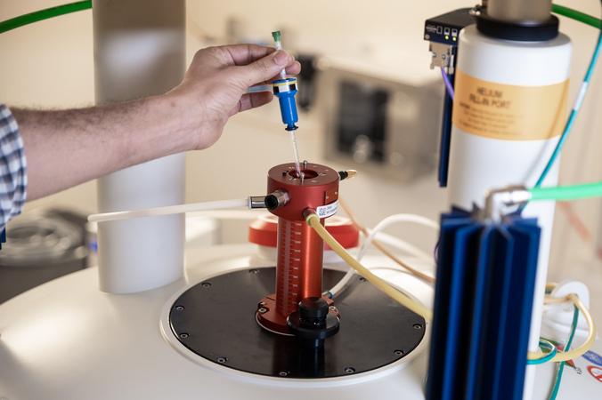

# Welcome to the NMR tutorials

For additional information about the Structural Biology Platform, visit our [website](https://biochimie.umontreal.ca/en/scientific-platforms-bmm/structural-biology/).

To reserve time on one of our NMR spectrometer, please fill up this [form](https://biochimie.umontreal.ca/wp-content/uploads/sites/37/2018/10/NMR_time_request.pdf) and send it to the Structural Biology Platform manager, Normand Cyr, by [email](mailto:normand.cyr@umontreal.ca).

## What is NMR?

Nuclear magnetic resonance (NMR) is a spectroscopic approach to observe
local magnetic fields around certain nuclei being intrinsically
magnetic. The NMR signals are generated by exciting nuclei with radio
frequencies while being submitted to an external magnetic field. This is
typically done in aqueous solution, but can also be performed with solid
samples (see [solid-state
NMR](https://en.wikipedia.org/wiki/Solid-state_nuclear_magnetic_resonance)).

More specifically, in structural biology, it is a method used for the
determination of the three-dimensional molecular structure and dynamics
of proteins and nucleic acids at atomic resolution. The results obtained
from these measurements provide information about:

-   How atoms are linked chemically (primary structure)
-   How close atoms are positioned in space (secondary, tertiary
    structure)
-   How rapidly they move with respect to each other

Among the techniques used to determine the structure of biomolecules at
atomic resolution, NMR spectroscopy offers certain unique advantages,
including (i) the possibility to study the dynamics of biomolecular
folding and internal mobility over a wide range of timescales (from
pico- to millisecond) and (ii) the capability to investigate intra- and
intermolecular interactions under physiological conditions ([Sugiki *et
al*
2017](https://www.sciencedirect.com/science/article/pii/S2001037017300053?via%3Dihub)).

## Tutorial sections

-   Instrumentation:
    -   [Overview of the instrumentation](overview_instrumentation/) -
        to be familiar with the equipment in the laboratory
    -   [Software](details_instrument_software/) - pieces of software
        used by the instrument and for data analysis
-   NMR experiment:
    -   [Sample requirements](sample_requirements/) - how to prepare a
        good sample for NMR analysis
    -   [Running a basic 1D NMR experiment](1D_NMR_experiment/) - first
        steps into data acquisition
    -   [2D 15N-HSQC](2D_15N-HSQC/) - bring the second dimension
-   Data processing:
    -   [Basic processing of NMR data](basic_data_processing/) - initial
        data analysis and sample quality assessment

## References for this tutorial

### Demonstration data

If you would like to explore this tutorial with demonstration data, you
can download these datasets:

-   [Ubiquitin
    dataset](https://github.com/BioStruct-UdeM/ubiquitin_NMR_tutorial_data/archive/v1.0.zip)
    (ZIP file) for protein analysis. More experimental details and data
    organization on the [GitHub
    page](https://github.com/BioStruct-UdeM/ubiquitin_NMR_tutorial_data).
-   [RNA
    dataset](https://github.com/BioStruct-UdeM/RNA-NMR_tutorial_data/archive/v1.0.zip)
    (ZIP file) for RNA analysis. More experimental details and data
    organization on the [GitHub
    page](https://github.com/BioStruct-UdeM/RNA-NMR_tutorial_data).

### Web sites

-   [Protein NMR | A Practical Guide](https://www.protein-nmr.org.uk/)
-   [eNMR](http://triton.iqfr.csic.es/guide/eNMR/eNMRindex.html)
-   [University of Ottawa NMR Facility
    Blog](https://u-of-o-nmr-facility.blogspot.com)
-   [UCSD Skaggs School of Pharmacy and Pharmaceutical Sciences NMR
    Facility blog](https://sopnmr.blogspot.com/)

### Software required

The instructions on how to install individual softwares on your personal
computer are details on their respective websites.

-   [TopSpin](https://www.bruker.com/products/mr/nmr/nmr-software/nmr-software/topspin/overview.html)
-   [CcpNmr
    Analysis](https://www.ccpn.ac.uk/v2-software/software/analysis)
-   [nmrPipe](https://www.ibbr.umd.edu/nmrpipe/)
-   [ARIA](http://aria.pasteur.fr/)

You also need to get the latest updates available from ccpNMR Analysis
further down on their website.

Alternatively, the Structural Biology Platform has computers available
where recent versions of these softwares are installed (TopSpin is only
available on the computers controlling the spectrometers). Access to the
computer room is controlled by access codes. Contact [Normand
Cyr](maito:normand.cyr@umontreal.ca) in order to obtain a code.

### Scientific literature

-   [Sattler M, *et al*
    (1999)](https://doi.org/10.1016/S0079-6565(98)00025-9).
    Heteronuclear multidimensional NMR experiments for the structure
    determination of proteins in solution employing pulsed field
    gradients. *Progress in Nuclear Magnetic Resonance Spectroscopy*.
